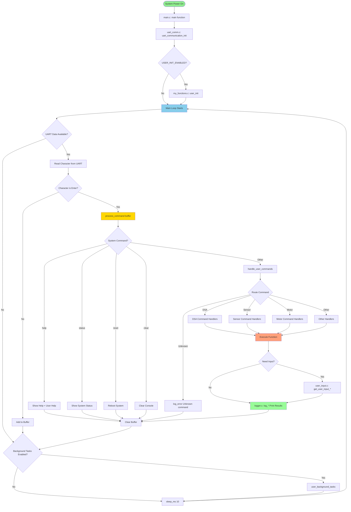
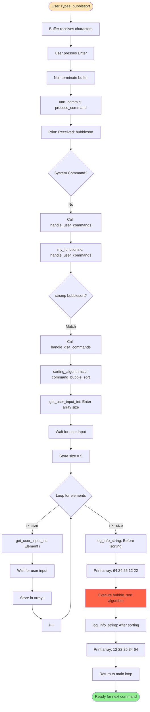
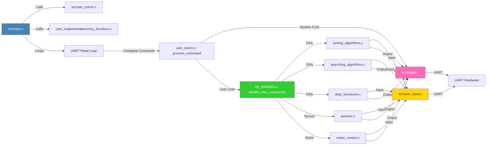
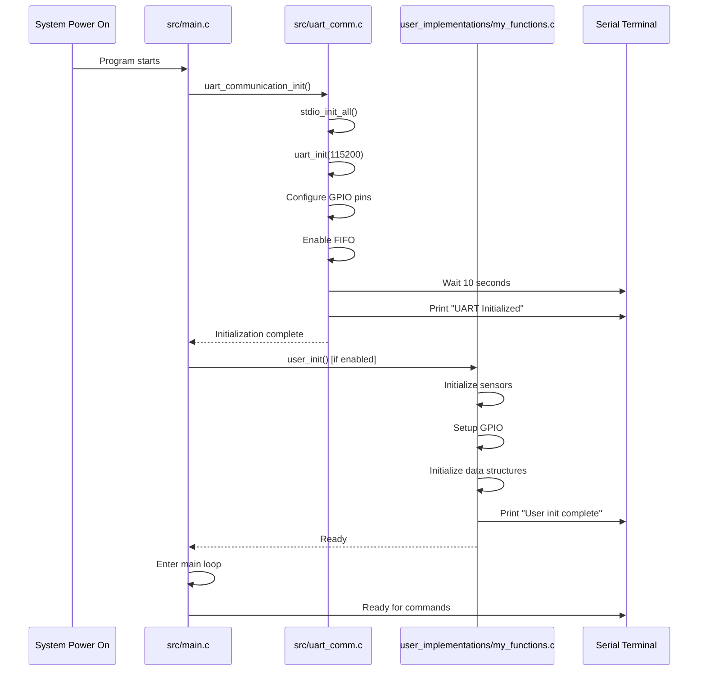
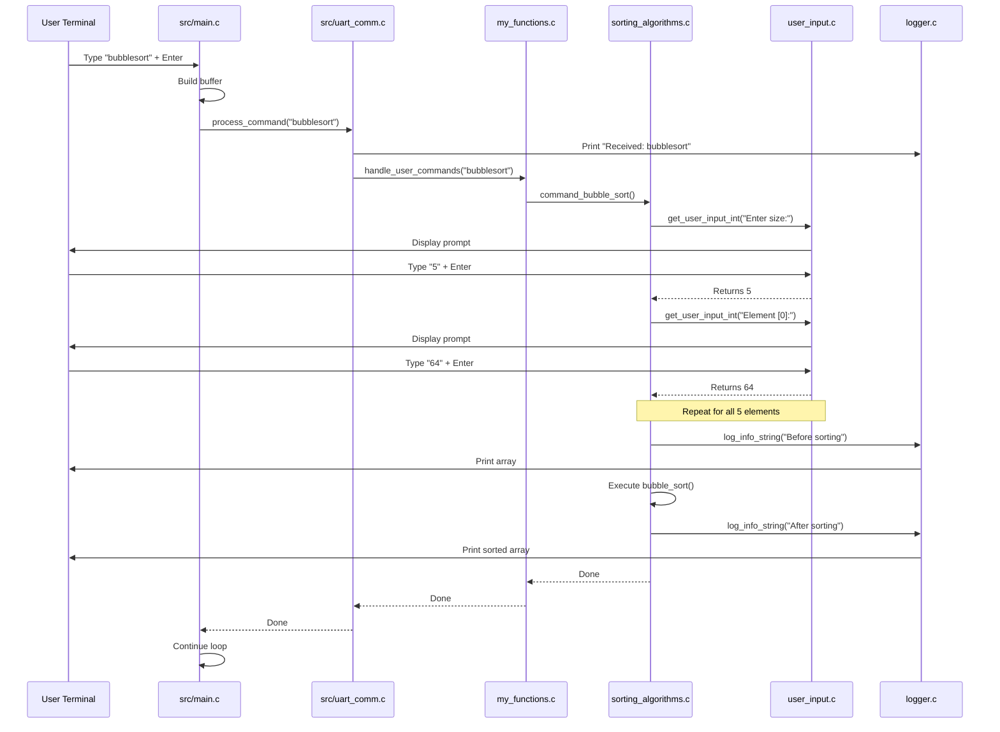

# Raspberry Pi Pico - Modular UART Communication Framework

A modular, scalable framework for developing applications on Raspberry Pi Pico with UART communication interface.

## 📁 Project Structure

```
project/
├── CMakeLists.txt
├── inc/                          # BASE LIBRARY (Don't modify)
│   ├── uart_comm.h              # UART communication header
│   ├── logger.h                 # Logging functions header
│   └── user_input.h             # User input functions header
├── src/                          # BASE LIBRARY (Don't modify)
│   ├── main.c                   # Main program entry point
│   ├── uart_comm.c              # UART initialization & command routing
│   ├── logger.c                 # Logging functions implementation
│   └── user_input.c             # User input functions implementation
└── user_implementations/         # YOUR WORK AREA
    ├── my_functions.c           # Main command handler
    ├── sorting_algorithms.c     # DSA: Sorting algorithms
    ├── searching_algorithms.c   # DSA: Searching algorithms
    ├── data_structures.c        # DSA: Stack, Queue, Linked List, etc.
    ├── graph_algorithms.c       # DSA: Graph algorithms (DFS, BFS, etc.)
    ├── sensors.c                # Sensor reading and control
    ├── motor_control.c          # Motor control functions
    └── utilities.c              # Helper/utility functions
```

## 🚀 Features

- ✅ **Modular Architecture** - Clean separation between base code and user implementations
- ✅ **UART Communication** - Full-duplex serial communication at 115200 baud
- ✅ **Command-Based Interface** - Easy command routing and handling
- ✅ **Input Helpers** - Built-in functions for int, float, and string input
- ✅ **Logging System** - Structured logging (INFO, ERROR, DEBUG, WARNING)
- ✅ **Extensible** - Add unlimited user implementation files
- ✅ **Real-time Capable** - Background tasks support
- ✅ **DSA Learning Platform** - Perfect for implementing and testing algorithms
- ✅ **IoT Ready** - Sensor integration and real-time data reading

## 📊 System Architecture

### Overall Control Flow



### Detailed Command Execution Flow



### File Interaction Diagram



### Initialization Sequence



### Command Processing Sequence



## 🔧 Getting Started

### Prerequisites

- Raspberry Pi Pico or Pico W
- Pico SDK installed
- CMake 3.13 or higher
- Serial terminal (PuTTY, minicom, screen, etc.)

### Building the Project

```bash
# Set Pico SDK path (if not already set)
export PICO_SDK_PATH=/path/to/pico-sdk

# Create build directory
mkdir build
cd build

# Configure CMake
cmake ..

# Build
make

# Flash to Pico (copy .uf2 file to Pico in BOOTSEL mode)
cp Pico_05_Generalized_Code.uf2 /media/RPI-RP2/
```

### Connecting to Serial Terminal

```bash
# Linux/Mac
screen /dev/ttyACM0 115200

# Or using minicom
minicom -D /dev/ttyACM0 -b 115200

# Windows - Use PuTTY with COM port and 115200 baud rate
```

## 📝 How to Add Your Own Commands

### Step 1: Create Your Function

In `user_implementations/my_functions.c` (or create a new file):

```c
void my_custom_function(void) {
    int num = get_user_input_int("Enter a number: ");
    log_info_int(num * 2);
}
```

### Step 2: Add Command Handler

In `handle_user_commands()`:

```c
void handle_user_commands(char *cmd) {
    // ... existing code ...
    
    else if (strcmp(cmd, "mycmd") == 0) {
        my_custom_function();
    }
}
```

### Step 3: Add Help Text

```c
if (strcmp(cmd, "help") == 0) {
    printf("  mycmd - My custom command\n");
    return;
}
```

### Step 4: Rebuild and Test

```bash
cd build
make
# Flash to Pico
# Type "mycmd" in terminal
```

## 🎯 Example Use Cases

### 1. DSA Learning Platform

Implement and test algorithms:
- Sorting: Bubble, Quick, Merge, Insertion, Selection
- Searching: Binary, Linear, Jump
- Data Structures: Stack, Queue, Linked List, Tree, Graph
- Dynamic Programming: Fibonacci, Knapsack, LCS

### 2. IoT Sensor Hub

Read and log sensor data:
- Temperature sensors (DHT11, DHT22, DS18B20)
- Distance sensors (HC-SR04)
- Motion sensors (PIR)
- Light sensors (LDR, BH1750)

### 3. Robotics Control

Control robots via UART:
- Motor control (direction, speed)
- Servo positioning
- Sensor-based navigation
- Autonomous behaviors

### 4. Data Logger

Log data to serial or storage:
- Real-time sensor readings
- Environmental monitoring
- Performance benchmarking
- Debug logging

## 📚 Available Base Functions

### User Input Functions
```c
int get_user_input_int(char *prompt);
float get_user_input_float(char *prompt);
void get_user_input_string(char *prompt, char *output_buffer, int max_length);
```

### Logging Functions
```c
void log_error(char *prompt);
void log_system_status(char *prompt);
void log_debug(char *prompt);
void log_warning(char *prompt);
void log_info_int(int value);
void log_info_string(char *str);
void log_info_float(float value);
void clear_console(void);
```

## 🔌 System Commands

| Command | Description |
|---------|-------------|
| `help` | Show all available commands |
| `status` | Display system status |
| `reset` | Reboot the system |
| `clear` or `cls` | Clear the console |

## 🤝 Contributing

1. Create your implementation in `user_implementations/`
2. Add files to `CMakeLists.txt`
3. Update this README with your commands
4. Test thoroughly
5. Submit PR (if sharing)

## 📄 License

This project is open source and available under the MIT License.

## 🙏 Acknowledgments

- Raspberry Pi Foundation for Pico SDK
- Community contributors and testers

---

**Happy Coding! 🚀**

For questions or issues, please open an issue on GitHub.